# Financial Credit-Risk QLoRA Fine-Tuning & Evaluation Pipeline

A production-grade PyTorch pipeline that fine-tunes an open-weight base model (`Qwen/Qwen2.5-7B-Instruct`) on financial credit-risk disclosures using 4-bit NF4 Quantized Low-Rank Adaptation (QLoRA via PEFT & bitsandbytes), with automated LLM-as-a-Judge evaluation powered by Google Gemini 1.5 Pro.

---

## 🏗️ System Architecture

```mermaid
flowchart TD
    subgraph Data["1. Data Ingestion & Transformation"]
        D1["Raw Financial Disclosures<br/>(data/train_dataset.jsonl, data/eval_dataset.jsonl)"] --> D2["FinancialDatasetPreparer<br/>(src/finetune/dataset_loader.py)"]
        D2 --> D3["ChatML Tokenization & Prompt Formatting<br/>(System + User + Assistant)"]
    end

    subgraph QLoRA["2. 4-bit NF4 QLoRA Fine-Tuning Engine"]
        M1["Base Model<br/>(Qwen/Qwen2.5-7B-Instruct)"] --> M2["BitsAndBytes 4-bit NF4 Quantization<br/>(Double Quantization, FP16 Compute)"]
        M2 --> M3["PEFT LoRA Injection<br/>(r=16, alpha=32, target: attention + MLP)"]
        D3 --> T1["TRL SFTTrainer<br/>(src/finetune/trainer.py)"]
        M3 --> T1
        T1 --> T2["Trained LoRA Adapter Weights<br/>(./lora_financial_credit_weights)"]
    end

    subgraph Serving["3. Inference & Serving Layer"]
        T2 --> S1["FinancialPredictor<br/>(src/serve/predictor.py)"]
        M1 --> S1
        S1 --> S2["FastAPI Web Server<br/>(POST /predict, GET /health)"]
        Client["Client / Financial Analyst"] -->|"REST API Call"| S2
        S2 -->|"Predicted Assessment"| Client
    end

    subgraph Eval["4. LLM-as-a-Judge Evaluation Engine"]
        S1 -->|"Candidate Model Output"| J1["LLMJudgeEvaluator<br/>(src/eval/judge_evaluator.py)"]
        D1 -->|"Context & Ground Truth"| J1
        J1 --> J2["Google Gemini 1.5 Pro<br/>(google-genai SDK)"]
        J2 --> J3["Pydantic Structured Evaluation<br/>(JudgeScoreSchema)"]
        J3 --> J4["Metrics:<br/>- financial_accuracy_score (0.0-1.0)<br/>- hallucination_detected (bool)<br/>- reasoning (text)"]
    end

    subgraph Config["5. Configuration & Orchestration"]
        CFG["PipelineSettings (.env)<br/>(src/config.py)"] -.-> Data
        CFG -.-> QLoRA
        CFG -.-> Serving
        CFG -.-> Eval
        CLI["CLI Orchestrator (main.py)<br/>(--mode train / eval / serve / demo)"] -.-> QLoRA
        CLI -.-> Serving
        CLI -.-> Eval
    end
```



---

## 🔍 Technical Deep Dive

### 1. Data Ingestion & Transformation (`src/finetune/dataset_loader.py`)
- **Financial Context:** Formats corporate earnings releases, leverage ratios, and liquidity disclosures into standardized ChatML instruction format.
- **Instruction Template:**
  ```text
  <|im_start|>system
  You are a Senior Financial Risk Analyst. Analyze corporate disclosures, determine credit risk impact (POSITIVE, NEGATIVE, NEUTRAL), and extract financial metrics.<|im_end|>
  <|im_start|>user
  Corporate Disclosure:
  [Corporate disclosure text]

  Task: Assess liquidity risk and state impact.<|im_end|>
  <|im_start|>assistant
  [Ground truth analysis and impact]<|im_end|>
  ```
- **Resilient Fallback:** Automatically switches to curated synthetic credit events if local files are missing, ensuring out-of-the-box pipeline portability.

### 2. 4-bit NF4 QLoRA Fine-Tuning Engine (`src/finetune/trainer.py`)
- **NF4 Quantization:** The 7B base model weights are loaded via `bitsandbytes` in 4-bit NormalFloat format with double quantization, reducing memory footprint by over 70%.
- **Low-Rank Adaptation (LoRA):** Freezes the base model and attaches trainable rank-decomposition matrices ($r=16, \alpha=32, \text{dropout}=0.05$) across attention (`q_proj`, `k_proj`, `v_proj`, `o_proj`) and feed-forward layers (`gate_proj`, `up_proj`, `down_proj`).
- **Memory-Efficient SFT:** Uses `trl.SFTTrainer` with gradient accumulation and FP16 compute dtype to train on consumer/workstation GPUs without OOM errors.

### 3. LLM-as-a-Judge Evaluation Engine (`src/eval/judge_evaluator.py`)
- **Deterministic Auditing:** Queries Google Gemini 1.5 Pro (`@google/genai`) with `temperature=0.0` to eliminate stochastic variations.
- **Structured Schema Enforcement:** Gemini outputs strictly conform to `JudgeScoreSchema`:
  - `financial_accuracy_score`: (0.0 to 1.0) Mathematical and analytical correctness.
  - `hallucination_detected`: Boolean flag flagging fabricated figures or unsupported conclusions.
  - `reasoning`: Analytical justification for the assigned score.

### 4. Inference & Serving Layer (`src/serve/predictor.py`)
- **`FinancialPredictor`:** Dynamically merges base model weights with fine-tuned LoRA adapters (`PeftModel.from_pretrained`).
- **Production API:** FastAPI service exposing `/predict` and `/health` endpoints with Pydantic request/response validation.

---

## 📁 Repository Structure

```text
fine_tune/
├── data/
│   ├── train_dataset.jsonl        # Training financial disclosure records
│   └── eval_dataset.jsonl         # Evaluation benchmark records
├── src/
│   ├── __init__.py
│   ├── config.py                  # Pydantic Settings & Hyperparameters
│   ├── finetune/
│   │   ├── __init__.py
│   │   ├── dataset_loader.py      # ChatML dataset formatting & preprocessing
│   │   └── trainer.py             # 4-bit NF4 QLoRA SFTTrainer engine
│   ├── eval/
│   │   ├── __init__.py
│   │   └── judge_evaluator.py     # Gemini 1.5 Pro LLM-as-a-Judge benchmark
│   └── serve/
│       ├── __init__.py
│       └── predictor.py           # FastAPI serving and PEFT model inference
├── .env.example                   # Environment variable template
├── main.py                        # Pipeline entrypoint CLI (train, eval, serve, demo)
├── prd.md                         # Product Requirements Document
├── requirements.txt               # Dependency specification
└── README.md
```

---

## 🛠️ Installation & Setup

1. **Clone the repository and navigate to the directory:**
   ```bash
   cd C:\BetaProj\Project\fine_tune
   ```

2. **Create and activate a virtual environment:**
   ```bash
   python -m venv venv
   # On Windows (PowerShell):
   .\venv\Scripts\Activate.ps1
   # On Linux/macOS:
   source venv/bin/activate
   ```

3. **Install dependencies:**
   ```bash
   pip install -r requirements.txt
   ```

4. **Configure environment variables:**
   Copy `.env.example` to `.env` and set your API keys:
   ```bash
   cp .env.example .env
   ```
   Provide your Google Gemini API key:
   ```ini
   GEMINI_API_KEY=your_gemini_api_key_here
   ```

---

## 🚀 Usage

### 1. Run Default Demo / Judge Benchmark
Runs the LLM-as-a-Judge evaluation benchmark on a sample credit risk scenario:
```bash
python main.py
# or
python main.py --mode demo
```

### 2. Fine-Tune with QLoRA
Executes 4-bit NF4 quantized LoRA fine-tuning using `trl.SFTTrainer`:
```bash
python main.py --mode train
```
Adapter weights and tokenizer are saved to `./lora_financial_credit_weights`.

### 3. Serve via FastAPI
Launch the REST API for real-time model inference:
```bash
python main.py --mode serve
```
Interactive Swagger documentation is available at `http://localhost:8000/docs`.

#### Sample Prediction Request:
```bash
curl -X POST "http://localhost:8000/predict" \
     -H "Content-Type: application/json" \
     -d '{
       "context": "Company X reported EBITDA margin expansion of 220bps to 18.5%, but debt-to-equity ratio spiked to 4.2x following the acquisition.",
       "max_new_tokens": 256,
       "temperature": 0.1
     }'
```

---

## ⚙️ Configuration & Hyperparameters

Key settings in [src/config.py](file:///C:/BetaProj/Project/fine_tune/src/config.py) (override via `.env`):

| Variable | Default | Description |
| :--- | :--- | :--- |
| `BASE_MODEL_ID` | `Qwen/Qwen2.5-7B-Instruct` | Base model Hugging Face repository ID |
| `OUTPUT_DIR` | `./lora_financial_credit_weights` | Path to save trained LoRA adapters |
| `LORA_R` | `16` | Rank parameter for LoRA adapters |
| `LORA_ALPHA` | `32` | Scaling parameter for LoRA updates |
| `LORA_DROPOUT` | `0.05` | Dropout probability for LoRA layers |
| `BATCH_SIZE` | `2` | Training batch size per device |
| `GRADIENT_ACCUMULATION_STEPS` | `4` | Effective batch size multiplier |
| `LEARNING_RATE` | `2e-4` | Peak learning rate for AdamW |
| `NUM_EPOCHS` | `3` | Number of training epochs |
| `MAX_SEQ_LENGTH` | `1024` | Maximum sequence length for SFT |
